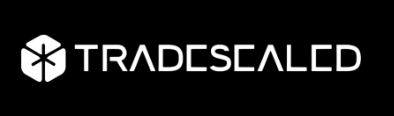
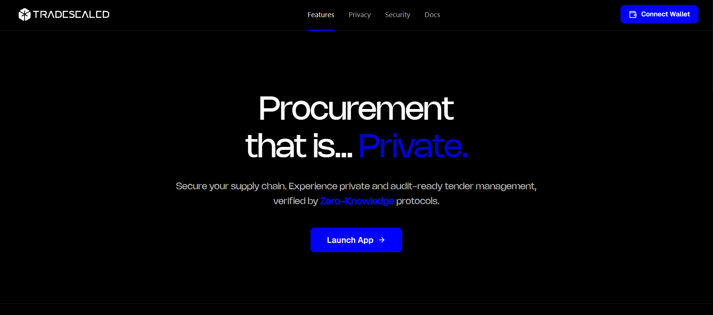
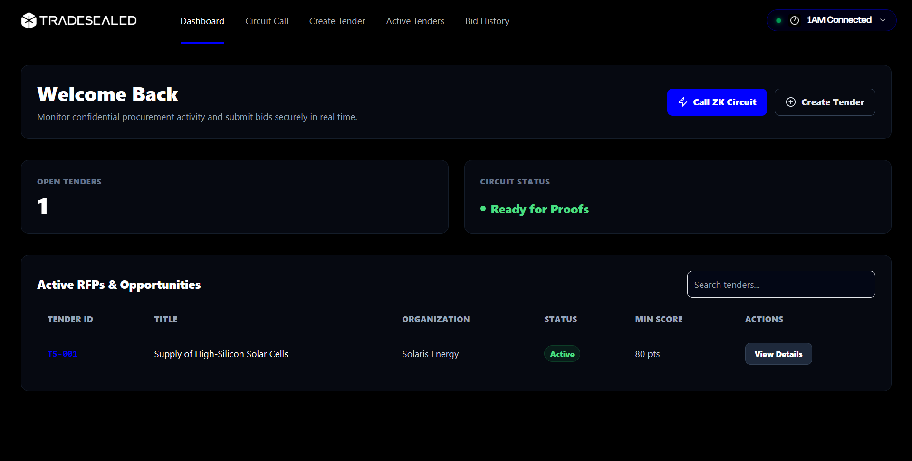
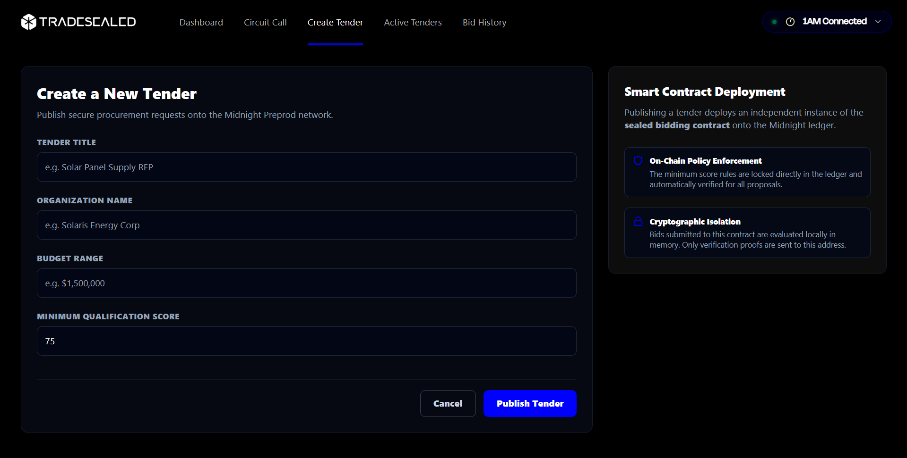
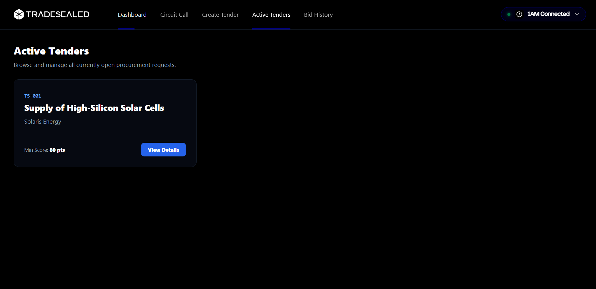

<div align="center">
  <h1 align="center"></h1>
  <br />
  
  
  
  
  
  
  <br /><br />
  <h3>
    🌐 <a href="https://tradesealed.vercel.app">Live Demo Website</a>
    &nbsp;&nbsp;•&nbsp;&nbsp;
    🎬 <a href="https://drive.google.com/file/d/1RKY3FXyayJEOekOWp567k2l6mqSPG4Gl/view?usp=drivesdk">Demo Video Walkthrough</a>
  </h3>
</div>

<br />

> Confidential, production-grade B2B procurement and sealed-bid auction portal built on the Midnight Network with Zero-Knowledge cryptography.

**TradeSealed** streamlines enterprise Requests for Proposals (RFPs) and vendor supply tenders by utilizing Zero-Knowledge cryptography. Vendors submit competitive pricing quotes in complete privacy without risking data leaks, collusion, or front-running. Built for the **First Quarter (Level 2)** challenge as part of the **RiseIn & Midnight Foundation "New Moon to Full: Monthly Moonshots on Midnight" Program 2026**.

---

## 🌐 Live Demo

[tradesealed.vercel.app](https://tradesealed.vercel.app)

---

## 📋 Contract Address

| Network  | Address |
|----------|---------|
| **Preprod** | `0x6823a11cd72d4eff83f5b440f4e08f4e94c16d69c679ef63c28a45a8229961ef` |

> Verifiable on [Midnight Preprod Explorer](https://preprod.midnightexplorer.com)

---

## 🌒 Level 2 Requirements & Submission Checklist

### 📋 Requirements to Pass
- **Lace wallet connect / disconnect implemented:** ✅ **Passed** — Connected successfully in the browser using the Browser DApp Connector API for both Lace and 1AM wallet extensions.
- **Circuit called successfully from the frontend:** ✅ **Passed** — The `submit_bid()` circuit runs in local ZK prover client-side memory and broadcasts via contract wrapper.
- **An observable privacy behavior (something proven without being shown):** ✅ **Passed** — Bid parameters (`bid_price` and `vendor_qualification_score`) are evaluated locally inside ZK memory. The mathematical proof verifies they meet criteria without exposing exact values on-chain.
- **Contract deployed to Preprod with a verifiable address:** ✅ **Passed** — Deployed at [`0x6823a11cd72d4eff83f5b440f4e08f4e94c16d69c679ef63c28a45a8229961ef`](https://preprod.midnightexplorer.com/contracts/0x6823a11cd72d4eff83f5b440f4e08f4e94c16d69c679ef63c28a45a8229961ef).
- **Minimum 8 meaningful commits:** ✅ **Passed** — Comprehensive conventional git history with over 15 commits.

### 📤 Submission Checklist
- **Public GitHub repository with README:** ✅ **Passed** — [github.com/yashannadate/TradeSealed](https://github.com/yashannadate/TradeSealed)
- **Live demo link (Vercel, Netlify, or similar):** ✅ **Passed** — Deployed to [tradesealed.vercel.app](https://tradesealed.vercel.app)
- **Deployed Preprod contract address (verifiable on-chain):** ✅ **Passed** — [`0x6823a11cd72d4eff83f5b440f4e08f4e94c16d69c679ef63c28a45a8229961ef`](https://preprod.midnightexplorer.com/contracts/0x6823a11cd72d4eff83f5b440f4e08f4e94c16d69c679ef63c28a45a8229961ef)
- **Demo video: wallet connect + a successful circuit call:** ✅ **Passed** — Watch on [Google Drive](https://drive.google.com/file/d/1RKY3FXyayJEOekOWp567k2l6mqSPG4Gl/view?usp=drivesdk)
- **README documenting the privacy claim:** ✅ **Passed** — Documented in [Privacy Claim](#-privacy-claim) section below.
- **Minimum 8 meaningful commits:** ✅ **Passed** — Checked.

---

## 💡 What This Does

TradeSealed is a confidential procurement portal where:

1. **Tender authorities** publish Requests for Proposals (RFPs) on the Midnight Preprod blockchain.
2. **Vendors** connect their wallet (Lace or 1AM) and submit sealed bids by generating a Zero-Knowledge proof locally in their browser.
3. The ZK proof mathematically verifies that the vendor's bid price is greater than zero and their qualification score meets the minimum threshold.
4. **Only a proof and the updated bid count** are recorded on the blockchain — the actual bid price and qualification score are **never transmitted or stored anywhere**.
5. After the tender period, selective disclosure reveals only the final outcome, preserving vendor trade secrets forever.

---

## 🔒 Privacy Model

### What is PUBLIC (On-Chain — Visible to Everyone):
- Tender authority address
- Minimum qualification score threshold
- Total number of bids submitted (counter)
- Whether the tender is currently active

### What is PRIVATE (Off-Chain — Never Leaves Your Browser):
- 🔒 Your exact bid price amount
- 🔒 Your vendor qualification score
- 🔒 Your vendor identity key
- 🔒 All witness input values

### What the User PROVES Without Revealing:
- ✅ That the bid price is **greater than zero** (valid bid)
- ✅ That the qualification score **meets or exceeds** the minimum threshold
- ✅ That the bid submission is **authorized** by a connected wallet
- ❌ The actual dollar amount of the bid is **never disclosed**
- ❌ The actual qualification score is **never disclosed**

---

## 🛡️ Privacy Claim

> **An on-chain observer can see** that a valid bid was submitted, the total bid count incremented, and the tender remains active. **An on-chain observer CANNOT see** the vendor's bid price, qualification score, or any private witness inputs. The ZK circuit mathematically proves `bid_price > 0` and `vendor_score >= minimum_qualification_score` without passing these values through `disclose()`. The private witness callbacks (`bid_price()` and `vendor_qualification_score()`) execute exclusively on the client machine and their return values never enter the public ledger state.

This is verified by our automated test suite, which confirms that private witness values do not appear in the serialized public contract state after circuit execution.

---

## ✨ Features

* 🔐 **Confidential Bidding** — Vendors submit price quotes inside local ZK private witnesses without revealing amounts on-chain.
* 🛡️ **Automated Qualification Gating** — The ZK circuit mathematically proves vendor eligibility before accepting bids.
* ⚡ **Selective Disclosure** — Public state counters update dynamically while keeping commercial bids hidden.
* 🔗 **Multi-Wallet Support** — Connect with Lace Wallet or 1AM Wallet extensions.
* 🔌 **Wallet Disconnect** — Clean session management with full state reset.
* 🔍 **Frontend Circuit Execution** — Call `submit_bid()` directly from the browser with real-time proof generation feedback.
* 🏷️ **Privacy Label** — "Proved without revealing your input" displayed after every successful circuit call.
* 📊 **Blockchain Explorer** — Query live contract state from Midnight Preprod indexer.

---

## 🛠️ Tech Stack

| Layer | Technology | Description |
| :--- | :--- | :--- |
| **Smart Contract** | Compact Language (`v0.22.0+`) | Native ZK domain-specific language for public/private state transitions |
| **Compiler** | Midnight Compact CLI (`v0.30.0`) | Compiles `.compact` code into ZKIR circuits and TypeScript wrappers |
| **Runtime SDK** | `@midnight-ntwrk/compact-runtime` | TypeScript execution environment for contract simulation and proofs |
| **Frontend** | React + Vite + TypeScript | Modern SPA with component-based architecture |
| **Wallet Integration** | `@midnight-ntwrk/dapp-connector-api` | DApp Connector API for Lace and 1AM wallet extensions |
| **Contract SDK** | `@midnight-ntwrk/midnight-js-contracts` | Contract deployment, discovery, and circuit call execution |
| **Testing** | Vitest / TypeScript | Automated unit tests for constructor, circuit execution, and privacy verification |
| **Target Network** | Midnight Preprod | Live staging network for privacy-preserving dApps |
| **Deployment** | Vercel | Static hosting for the frontend application |

---

## 📋 Prerequisites

- **Lace Wallet** (Midnight Beta) or **1AM Wallet** browser extension installed and set to **Preprod** network
- **Node.js** v22+ LTS (`node -v`)
- **Docker Desktop** running with Midnight Proof Server container (for local ZK proof generation)
- **WSL 2 (Ubuntu)** or Linux/macOS (for Compact compiler)

---

## 🚀 Run Locally

### 1. Clone the Repository
```bash
git clone https://github.com/yashannadate/TradeSealed.git
cd TradeSealed
```

### 2. Install Dependencies
```bash
npm install
cd deploy-harness && npm install && cd ..
```

### 3. Compile the Compact Smart Contract (WSL/Linux)
```bash
npm run compile
```

### 4. Run the Automated Test Suite
```bash
npm test
```

### 5. Start the Frontend Development Server
```bash
npm run dev
```
Open `http://localhost:5173` in your browser.

### 6. Start the Proof Server (Docker)
```bash
docker start proof-server
```

### 7. Connect Wallet & Call Circuit
1. Open `http://localhost:5173` → Click **Launch App**
2. Click **Connect Wallet** → Select **Lace** or **1AM** → Approve in extension
3. Navigate to **Circuit Call** in the sidebar
4. Click **Call Circuit — Submit Sealed Bid**
5. Wait for ZK proof generation (30–60 seconds)
6. See "Proved without revealing your input" confirmation

---

## 🎬 Demo Video

[Watch the TradeSealed Level 2 Demo Video on Google Drive](https://drive.google.com/file/d/1RKY3FXyayJEOekOWp567k2l6mqSPG4Gl/view?usp=drivesdk)

### What to Record (Under 2 Minutes):
1. **Connect Lace wallet** — show the address appear on screen
2. **Navigate to Circuit Call page** — show the Public vs Private comparison
3. **Click "Call Circuit"** — show the loading state during ZK proof generation
4. **Show the on-chain result** — transaction hash and "Proved without revealing your input" label
5. **Point out** that the private bid price and score were never shown in the UI
6. **Disconnect wallet** — show the UI reset to disconnected state

---

## 🔒 Security & Architecture: Public State vs. Private Witness

```text
[ Bidder's Local Proving Engine ]                  [ Midnight Preprod Blockchain Ledger ]
┌──────────────────────────────────────┐           ┌──────────────────────────────────────────────┐
│ Private Witness Inputs (Off-Chain):  │           │ Public Ledger State (Visible to All):        │
│ • Vendor Secret Identity Key         │  ──(ZK)─► │ • Tender Authority Address                   │
│ • Bid Price Quote (e.g. $45,000)     │  Proof    │ • Minimum Required Qualification Score       │
│ • Vendor Technical Rating Score      │           │ • Total Bids Received Counter (bids_count)   │
└──────────────────────────────────────┘           └──────────────────────────────────────────────┘
```

* **Public Ledger State (`export ledger`)**: Stores universal RFP metadata. Everyone can inspect these fields.
* **Private Witness Callbacks (`witness`)**: Declares local functions that run *exclusively on the user's client machine*.
* **Deliberate Selective Disclosure**: The `submit_bid()` circuit asserts `bid_price > 0` and `vendor_qualification_score >= minimum_qualification_score`. Upon success, it updates `bids_count.increment(1)`. **No price or score is ever passed to `disclose()`**, proving a valid bid was submitted while preserving 100% commercial secrecy.

---

## 📁 Project Structure

```text
TradeSealed/
├── contract/
│   └── src/
│       └── sealed_bidding.compact   ← ZK smart contract
├── deploy-harness/
│   ├── src/
│   │   ├── components/
│   │   │   ├── WalletConnect.tsx    ← wallet connect/disconnect UI
│   │   │   └── CircuitCall.tsx      ← circuit call button + result display
│   │   ├── hooks/
│   │   │   └── useMidnight.ts       ← Midnight.js SDK hook
│   │   ├── App.tsx
│   │   └── main.tsx
│   ├── public/
│   ├── package.json
│   └── vite.config.ts
├── vercel.json
├── package.json
└── README.md
```

## 📸 Application Interface

| Landing Page | Main Dashboard |
| :---: | :---: |
|  |  |
| **Create Tender** | **Active Tenders** |
|  |  |

---

## 📷 Level 1 Verification Screenshots (Retained)

### 1. Successful Compile Output (Circuits Listed)


### 2. Automated Test Suite Passing


### 3. Contract Deployed on Midnight Preprod (Explorer Address Verification)


* **Network**: Midnight Preprod
* **Deployment Method**: Contract was deployed using the official Midnight Browser DApp Connector (1AM Wallet) through the browser deployment harness.
* **Contract Address**: [`0x6823a11cd72d4eff83f5b440f4e08f4e94c16d69c679ef63c28a45a8229961ef`](https://preprod.midnightexplorer.com/contracts/0x6823a11cd72d4eff83f5b440f4e08f4e94c16d69c679ef63c28a45a8229961ef)
* **Deployment Transaction Hash**: `205c601428afde4905a93d84700781251e29b73957304cf41ef7e1e2dfb65940`
* **Fees Paid**: 1 speck (sponsored by 1AM ProofStation)

---

## 🖥️ Browser Deployment Harness

We utilize the official Midnight Browser DApp Connector API (`window.midnight["1am"]`) for fee balancing and transaction broadcasting to avoid syncing the entire blockchain in Node.js.

### Running the Harness
1. **Start the Proof Server**:
   Ensure Docker is running and launch the proof server container:
   ```bash
   docker start proof-server
   ```
2. **Launch Vite Development Server**:
   Navigate to the harness directory and start the local dev server:
   ```bash
   cd deploy-harness
   npm run dev
   ```
3. **Deploy**:
   * Open `http://localhost:5173` in your browser.
   * Click **Connect 1AM Wallet Extension** (ensure it's set to the Preprod network).
   * Click **Deploy Contract to Midnight Preprod** and confirm the popup in your 1AM wallet.

---

## 🙏 Acknowledgments

* **Midnight Foundation & IOG** for building the ground-breaking privacy-first blockchain architecture.
* **RiseIn** for hosting the *New Moon to Full* builder program.
* **Lace Wallet** for providing the official Midnight-compatible wallet extension.
* **1AM Wallet & ProofStation** for sponsoring gas and enabling seamless browser testing.

---

<div align="center">
  <sub><b>New Moon to Full: Monthly Moonshots on Midnight 🌙</b></sub>
  <br />
  <sub>Developed by <b>Yash Annadate</b></sub>
</div>
